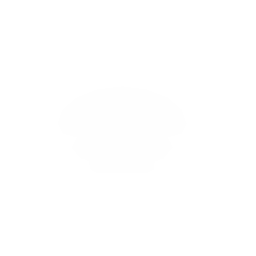

## Function
## getFunction(one: string, two: int|obj)
## Description of text
### tst
Regular text

* Main Topic
    * Subtopic1

        Some Points for subtopic1

    * Subtopic2

        Some Points for subtopic2


Args:

	count (int): The number of points to generate
	x,y,z (float,float,float): the center point/origin
	r (float): radius
	start (float, optional): the angle to start at in degrees. Default 0
	end (float, optional): the angle to end at in degrees default 360
		
Returns:

		points (generator): A generator of Vec3


```javascript
function yes(): no {
	let one = help.runaway()
}
```

more regular more regular more regular more regular more regular more regular more regular more regular more regular more regular more regular more regular more regular more regular more regular more regular more regular more regular more regular more regular more regular 


```javascript
(function) arc(count, x,y,z, r, start=0.0, end=90.0, random=False)
```
Calculate the points along an circular arc

	Args:
			count (int): The number of points to generate
			x,y,z (float,float,float): the center point/origin
			r (float): radius
			start (float, optional): the angle to start at in degrees. Default 0
			end (float, optional): the angle to end at in degrees default 360
			
	Returns:
			points (generator): A generator of Vec3

```text
 
```

```javascript\n(function) arc(count, x,y,z, r, start=0.0, end=90.0, random=False)\n```\nCalculate the points along an circular arc\n\n    Args:\n        count (int): The number of points to generate\n        x,y,z (float,float,float): the center point/origin\n        r (float): radius\n        start (float, optional): the angle to start at in degrees. Default 0\n        end (float, optional): the angle to end at in degrees default 360\n\n    Returns:\n        points (generator): A generator of Vec3\n    \n```\n \n```\nSource: artemis-sbs.sbs_utils.v1.0.4.sbslib\\sbs_utils/scatter.py


```javascript\n(function) arc(count, x,y,z, r, start=0.0, end=90.0, random=False)\n```\nCalculate the points along an circular arc\n\n&nbsp;Args:\n        count (int): The number of points to generate\n        x,y,z (float,float,float): the center point/origin\n        r (float): radius\n        start (float, optional): the angle to start at in degrees. Default 0\n        end (float, optional): the angle to end at in degrees default 360\n\n    Returns:\n        points (generator): A generator of Vec3\n    \n```\n \n```\nSource: artemis-sbs.sbs_utils.v1.0.4.sbslib\\sbs_utils/scatter.py


```javascript\n(function) arc(count, x,y,z, r, start=0.0, end=90.0, random=False)\n```\nCalculate the points along an circular arc\n\n&emsp;Args:\n        count (int): The number of points to generate\n        x,y,z (float,float,float): the center point/origin\n        r (float): radius\n        start (float, optional): the angle to start at in degrees. Default 0\n        end (float, optional): the angle to end at in degrees default 360\n\n    Returns:\n        points (generator): A generator of Vec3\n    \n```\n \n```\nSource: artemis-sbs.sbs_utils.v1.0.4.sbslib\\sbs_utils/scatter.py


```javascript\n(function) arc(count, x,y,z, r, start=0.0, end=90.0, random=False)\n```\nCalculate the points along an circular arc\\\n\\\n&emsp;Args:\\\n&emsp;&emsp;count (int): The number of points to generate\\\n&emsp;&emsp;x,y,z (float,float,float): the center point/origin\\\n&emsp;&emsp;r (float): radius\\\n&emsp;&emsp;start (float, optional): the angle to start at in degrees. Default 0\\\n&emsp;&emsp;end (float, optional): the angle to end at in degrees default 360\\\n\\\n&emsp;Returns:\\\n&emsp;&emsp;points (generator): A generator of Vec3\\\n&emsp;\n```\n \n```\nSource: artemis-sbs.sbs_utils.v1.0.4.sbslib\\sbs_utils/scatter.py

```javascript\n(function) arc(count, x,y,z, r, start=0.0, end=90.0, random=False)\n```\n```text\n\nCalculate the points along an circular arc\n\n    Args:\n        count (int): The number of points to generate\n        x,y,z (float,float,float): the center point/origin\n        r (float): radius\n        start (float, optional): the angle to start at in degrees. Default 0\n        end (float, optional): the angle to end at in degrees default 360\n\n    Returns:\n        points (generator): A generator of Vec3\n    ```\n```\n\n```\nSource: artemis-sbs.sbs_utils.v1.0.4.sbslib\\sbs_utils/scatter.py


Source: artemis-sbs.sbs_utils.v1.0.4.sbslib\\sbs_utils/scatter.py




<!-- 


 -->
